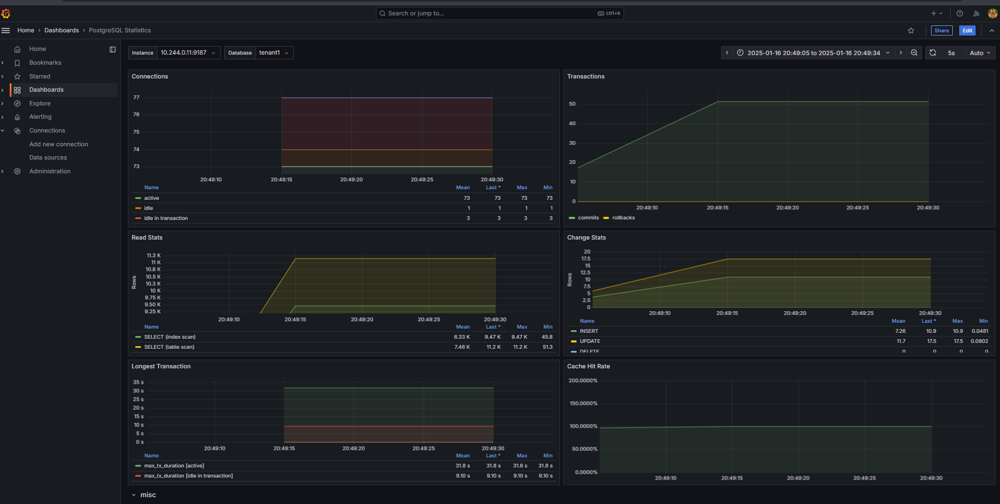
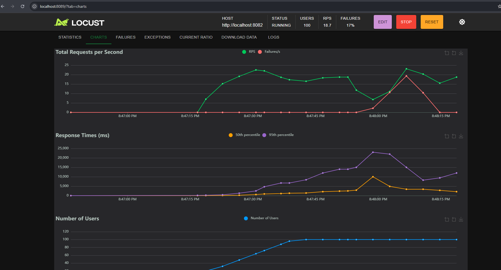

# Project Setup

## Required Tools

To work on this project, you need to have the following tools installed:

1. **kubectl**: Command line tool for controlling Kubernetes clusters.
   - Installation guide: [kubectl Installation](https://kubernetes.io/docs/tasks/tools/install-kubectl/)

2. **minikube**: Tool that runs a single-node Kubernetes cluster in a virtual machine on your personal computer.
   - Installation guide: [minikube Installation](https://minikube.sigs.k8s.io/docs/start/)

3. **Docker / Docker Desktop**: Platform for developing, shipping, and running applications in containers.
   - Installation guide: [Docker Installation](https://docs.docker.com/get-docker/)

4. **uv**: Python dependency management tool.
   - Installation guide: [uv Installation](https://docs.astral.sh/uv/getting-started/installation/#__tabbed_1_2)

5. **skaffold**: Command line tool that facilitates continuous development for Kubernetes applications.
   - Installation guide: [skaffold Installation](https://skaffold.dev/docs/install/)

6. **helm**: Kubernetes package manager.
   - Installation guide: [helm Installation](https://helm.sh/docs/intro/install/)

## Getting Started

1. Clone the repository.
2. Install the required tools listed above.

### Start Minikube

Start Minikube with the following options:

```sh
minikube start --addons=metrics-server --cpus='no-limit'
```
Wait until it finishes.

### helm chart requirements

add grafana chart
```sh
helm repo add grafana https://grafana.github.io/helm-charts
```
add postgresql / bitnami chart

```sh
helm repo add bitnami https://charts.bitnami.com/bitnami
```

add prometheus community chart

```sh
helm repo add prometheus-community https://prometheus-community.github.io/helm-charts
```

update the helm repo

```sh
helm repo update
```

### Prepare k8s ns

Create the k8s namespace for the project by running:

```sh
kubectl apply -f deployment/ns.yaml
```

### Install Metrics System and Setup Metrics

Install the metrics system by running:

```sh
skaffold run -f skaffold-base.yaml
```

This will initiate the metrics requirements for the clusters, including Grafana. Wait until it completes. It may fail because of a test check for Grafana, but that's alright.

### Build the Service and Postgres

Build the service and Postgres by running:

```sh
skaffold dev
```

This will pick up the skaffold.yaml file by default.

### port-forwarding grafana, postgres, and service

`Port forwarding service/postgresql-hl` in namespace databases, remote port 5432 -> `http://127.0.0.1:5432`

`Port forwarding service/web-app-service` in namespace default, remote port 80 -> `http://127.0.0.1:8082`


`Port forwarding service/grafana` in namespace monitoring, remote port 80 -> `http://127.0.0.1:3000`


### Setup Grafana

1. Open the browser and go to `http://localhost:3000`.
2. Login with the following credentials:
   - Username: `admin`
   - Password: `admin
3. Add a new data source:
    - Click on connection on the left sidebar.
    - Click on `Data Sources`.
    - Click on `Add data source`.
    - Select `prometheus` from the list.
    - Set the URL to `http://prometheus-server`.
    - Click on `Save & Test`.
4. Import the dashboard:
    - Click on the `+` icon on the top right sidebar.
    - Click on `Import Dashboard`.
    - Enter the dashboard ID `6742`.
    - Click on `Load`.
    - Select the Prometheus data source.
    - Click on `Import`.

## OPEN ANOTHER TERMINAL

### Test the Service

install python dependencies using uv

```sh
uv sync
```

Run the tests by running:

```sh
uv run locust -f locustfile.py
```

This will start the locust test runner. Open the browser and go to `http://localhost:8089` to start the test.

1. insert http://localhost:8082 as HOST
2. set number of user 50 - 100
3. set ramp up 2


### Metrics Dashboard



### Locust Test Results


